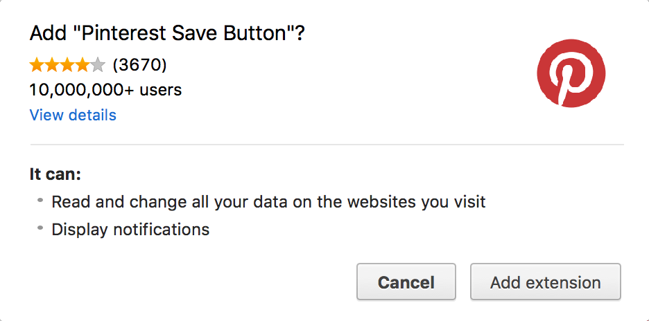

# ρ³ Pinterest Permissions Proof-of-concept
The Pinterest extension can function without accessing all of your Chrome data - here's how.

## Motivation
The [Pinterest Save Button](https://about.pinterest.com/en/browser-button) [Chrome extension](https://chrome.google.com/webstore/detail/pinterest-save-button/gpdjojdkbbmdfjfahjcgigfpmkopogic) allows users to collect images by quickly adding them to their Boards. Unfortunately, the extension requires some overbearing permissions. Namely, the ability to access all browsing data.

## Goal
The intent of this project is to demonstrate how the functionality of the Pinterest Save Button can be implemented without any special permissions.

## Criteria
* Achieve the goal requiring as few permissions as possible
* Do so as succinctly as possible while clearly expressing the intent

### Strategy
Take advantage of the [activeTab](https://developer.chrome.com/extensions/activeTab) permission to display no warning message during installation.

## Results
The results of this project will be summarized in a future commit.

## Demo
Click the preview for the full (19-second) clip.

